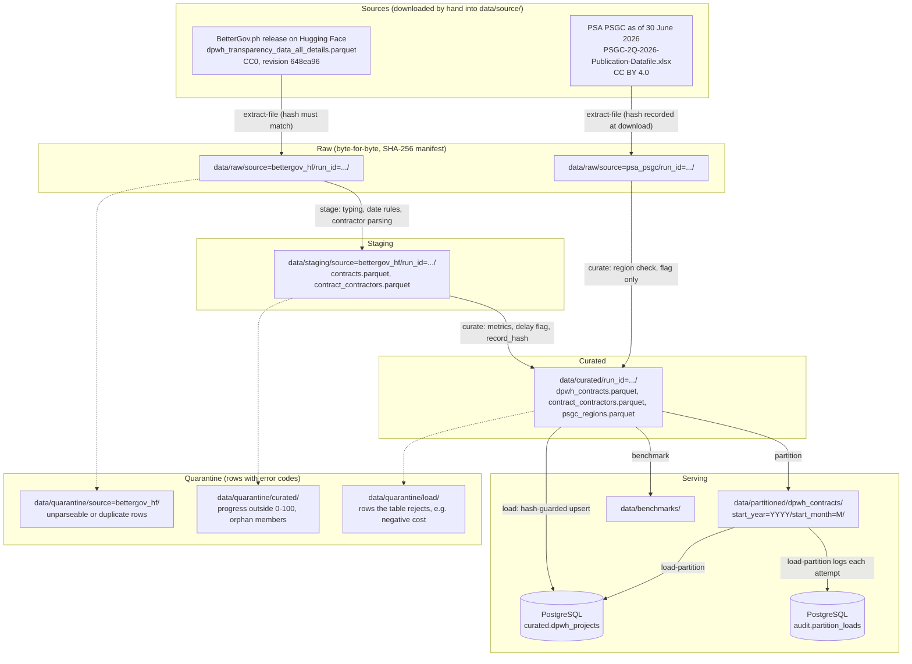

# Data Lineage

**Project:** Group Zeta DPWH Infrastructure Pipeline

How data moves from the two source files to the database, with the CLI command that performs each step and where rejected rows go. Every arrow is a `python -m src.cli` command; Airflow only runs those commands in this order.

`validate` reads every layer back: raw files against `manifest.jsonl`, each layer's outputs against their recorded SHA-256 and row counts, row reconciliation from raw to partitions, the curated calculations, and the database hashes against the curated file.
