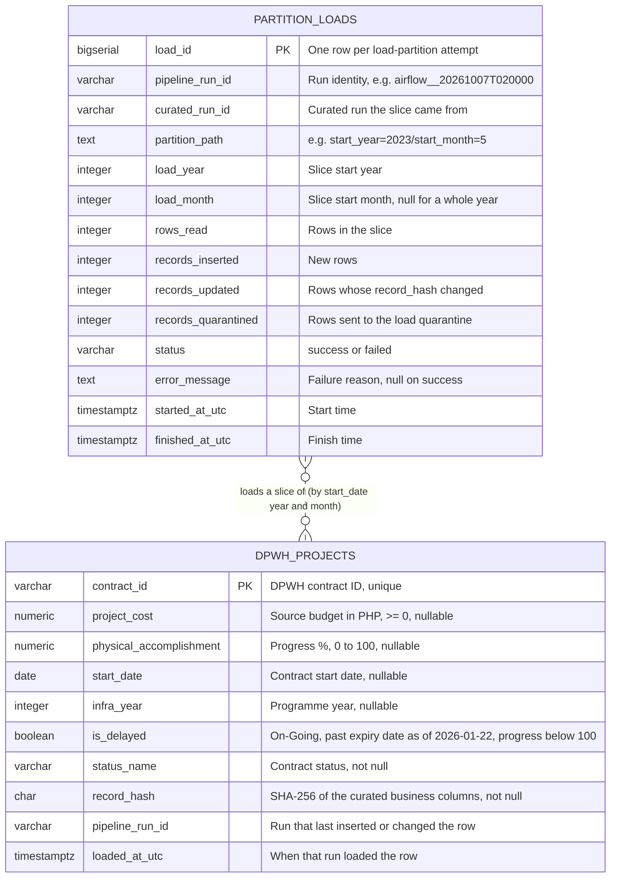

# Database Entity Relationship Diagram

**Project:** Group Zeta DPWH Infrastructure Pipeline

The PostgreSQL schema created by `sql/init/01_schema.sql`. `curated.dpwh_projects` holds one row per loaded contract; `audit.partition_loads` holds one row per `load-partition` attempt. The two tables are not joined by a foreign key: an audit row describes a slice of contracts (by start year and month), not a single contract. Airflow keeps its own metadata in the separate `airflow` schema.

Column constraints and the load quarantine codes are listed in `docs/data_contract.md` (Database load).
