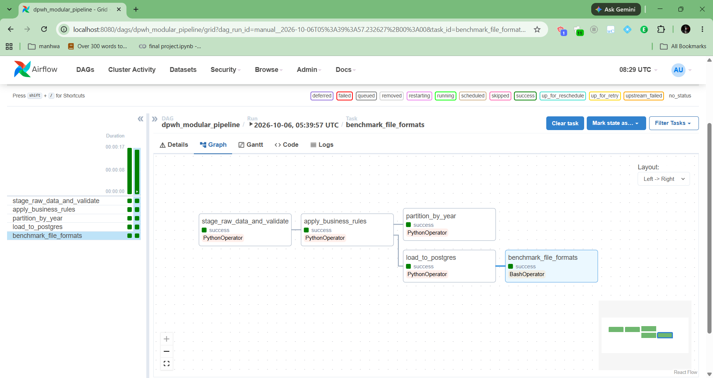
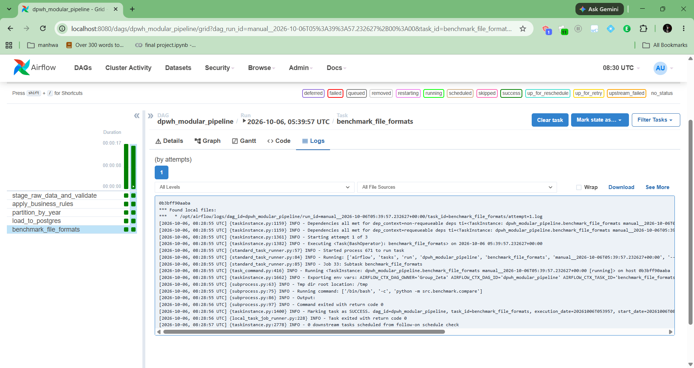
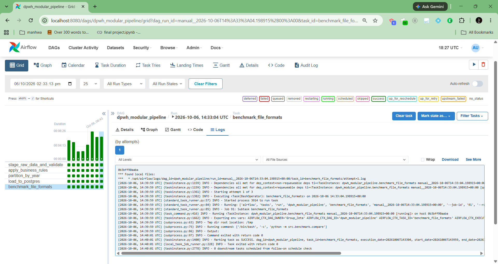
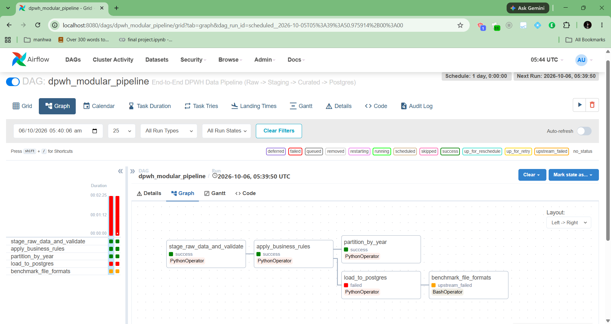
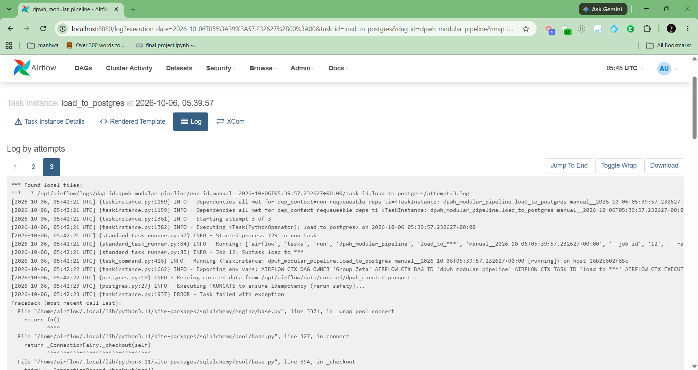
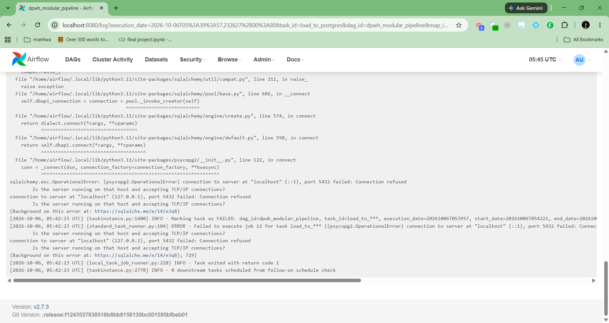
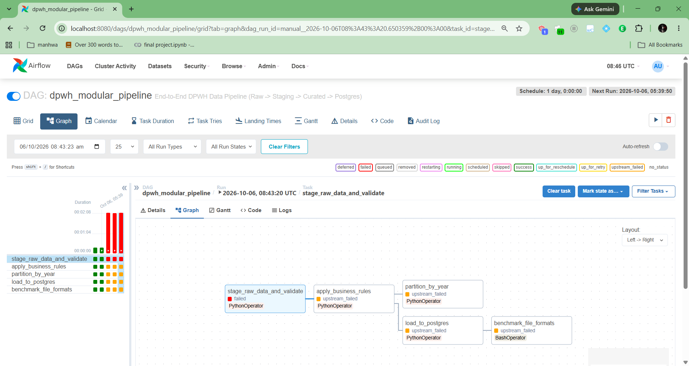
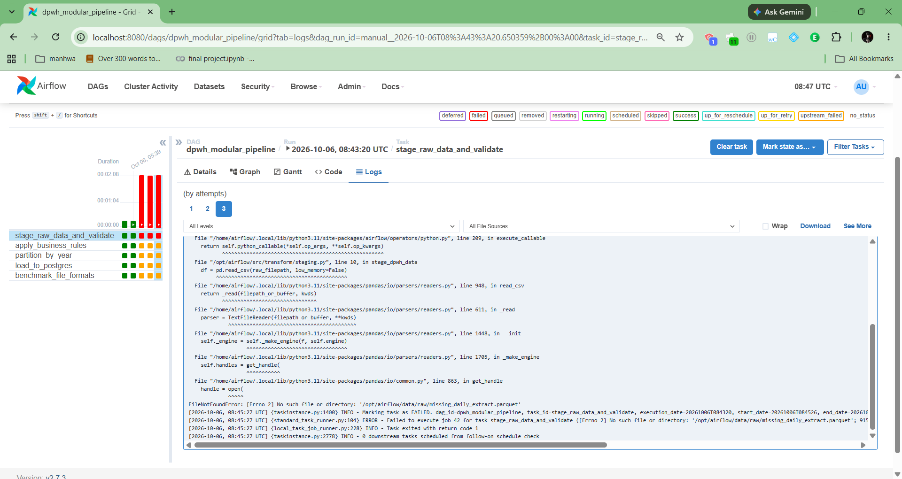

# Apache Airflow Orchestration & Diagnostics
**Project:** Group Zeta DPWH Infrastructure Pipeline
**Pipeline:** `dpwh_modular_pipeline`

## 1. Successful Pipeline Execution
The pipeline is orchestrated via Apache Airflow to run the ETL process idempotently. The DAG relies on sequential dependencies: data staging/validation, curation, partitioning, and database loading.

**Execution Flow:**
1. `stage_raw_data_and_validate`: Extracts the 97MB DPWH CSV, cleans column headers, and enforces 5 strict quality checks (schema, nullability, uniqueness, datatypes, value ranges).
2. `apply_business_rules`: Transforms the staged Parquet file by adding calculated columns (e.g., cost variance) and standardizing text.
3. `partition_by_year` & `load_to_postgres`: Branches out to partition the data locally and simultaneously truncate/load the curated dataset into the PostgreSQL database.
4. `benchmark_file_formats`: Executes the final CLI script to compare I/O performance.

**Status Proof:**

---

## 2. Diagnostics and Failure Handling
Airflow's logging mechanism allows us to pinpoint exactly where and why a data pipeline fails, fulfilling the requirement for transparent error diagnostics. 

### Actual Failure | Pipeline Failure Scenario: Docker Network Resolution Error

**Identification in UI:**
During execution, the pipeline successfully completed data staging, validation, curation, and partitioning. However, it failed at the `load_to_postgres` task. The Airflow UI correctly marked this node as failed (red) and immediately halted the downstream `benchmark_file_formats` task (orange/upstream_failed), preventing pipeline corruption.

**Log Diagnostics:**
By inspecting the task logs, we traced the failure to a Python SQLAlchemy `OperationalError`: `connection to server at "localhost" (::1), port 5432 failed: Connection refused`.

**Root Cause & Resolution:**
The pipeline failed due to a containerized networking conflict combined with an environment variable fallback issue. While `localhost` points to the database during local Windows testing, Apache Airflow operates inside an isolated Docker container and must use the container's internal hostname (`postgres`) to route traffic to the database. Because the `POSTGRES_HOST` variable was temporarily unavailable in the Airflow environment, the Python script (`src/load/postgres.py`) defaulted to its hardcoded fallback value, which was originally set to `"localhost"`. 

We resolved this by directly updating the script's connection logic to use the proper Docker network default: `db_host = os.environ.get("POSTGRES_HOST", "postgres")`. We then cleared the task state in the Airflow UI, allowing the scheduler to automatically re-run the node with the corrected configuration and successfully complete the pipeline.

### Simulated Failure | Pipeline Failure Scenario: Upstream Data Source Unavailable

**Identification in UI:**
During scheduled execution, the pipeline failed at the initial extraction phase (`stage_raw_data_and_validate`). The Airflow scheduler correctly identified the failure (red) and placed all dependent downstream transformation and loading tasks into an `upstream_failed` state (orange). This strict dependency management prevents the pipeline from processing empty or stale data.

**Log Diagnostics:**
Reviewing the execution logs for the failed task revealed a Python `FileNotFoundError`. The upstream ingestion step failed to deliver the expected raw Parquet file to the staging directory prior to the DAG's execution schedule.

**Root Cause & Resolution:**
The failure was caused by a missing source file in the `data/raw/` volume. To resolve this, the data engineering team must verify the upstream ingestion scraper (e.g., the BetterGov API extractor). Once the correct file is placed in the designated directory, the failed Airflow task is cleared, and the pipeline automatically resumes from the point of failure without needing to re-run preceding independent tasks.